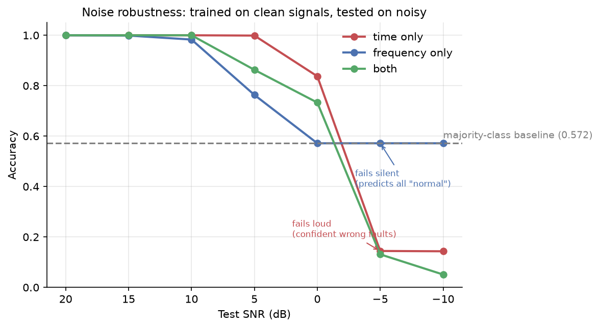
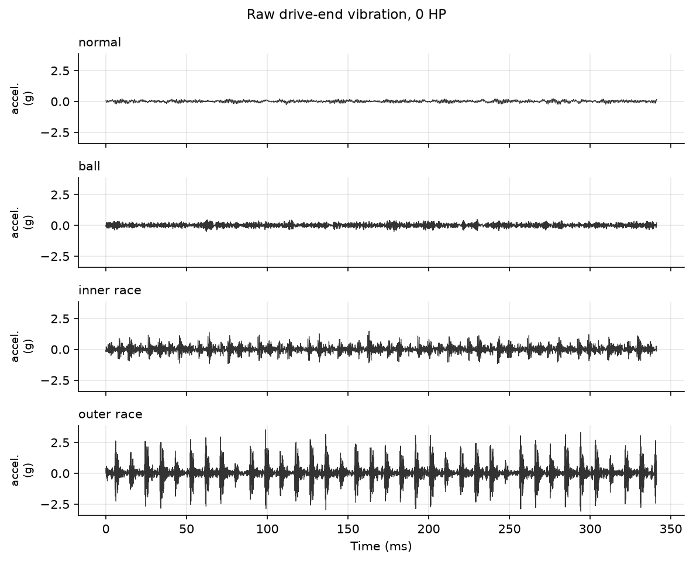
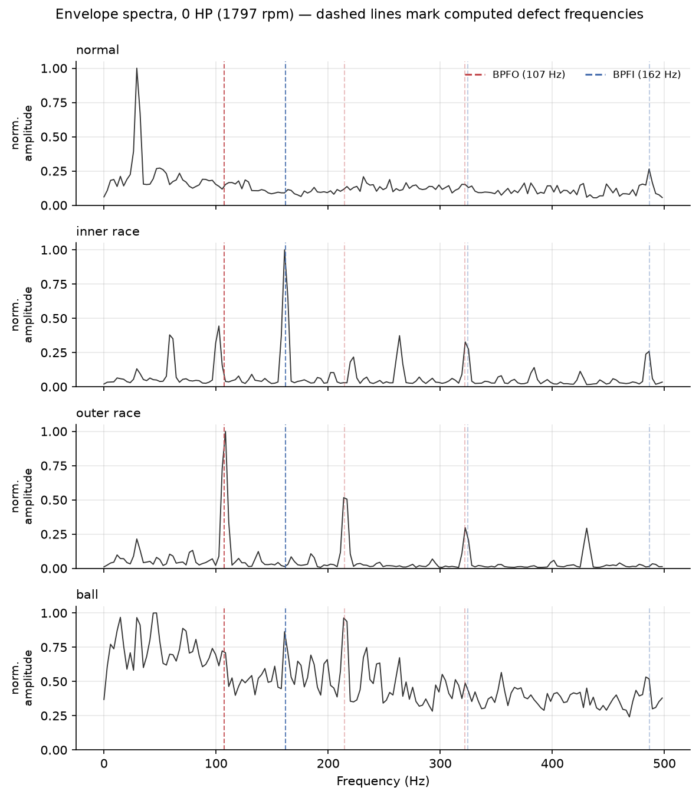
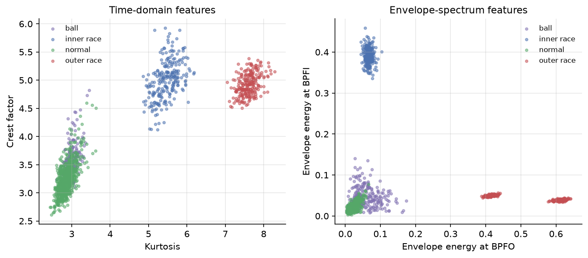
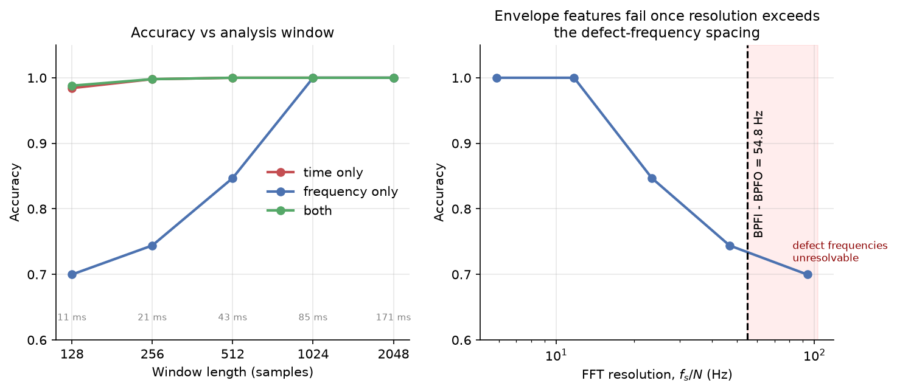

# Bearing Fault Diagnosis from Vibration Signals

Classical condition-monitoring pipeline for the CWRU bearing dataset. Extracts time-domain
statistics and envelope-spectrum features at physically derived defect frequencies, then
tests where each feature family breaks down under noise and short analysis windows.

The headline result is not an accuracy figure. Both feature families classify these faults
perfectly under clean conditions. The useful findings are **where they fail, and how
differently they fail**.



---

## Key findings

1. **Time-domain statistics outperform envelope features under broadband noise**, holding
   near-perfect accuracy down to 0 dB SNR while envelope features degrade from +10 dB. This
   contradicted the initial hypothesis.
2. **The two families fail in opposite and operationally significant ways.** Below 0 dB,
   envelope features collapse to predicting the majority class (57.2%, i.e. "everything is
   normal"), while time-domain features fall to 14.4%, far *below* the majority baseline —
   confidently predicting the wrong fault.
3. **Combining both feature sets is worse than either alone at low SNR** (5.1% at −10 dB).
   Noise-corrupted amplitude features degrade the combination.
4. **Class separability here rests largely on raw amplitude** — outer-race vibration is
   roughly 25x larger than normal — which explains the perfect baseline accuracy and the
   dominance of RMS and peak in the feature importances.
5. **The window-length breakdown point is predictable from theory.** Envelope features fail
   below 512 samples because FFT resolution becomes coarser than the spacing between the
   inner- and outer-race defect frequencies.

---

## Data

CWRU Bearing Data Center, 12 kHz drive-end accelerometer, 0.007" seeded faults.
Four classes (normal, inner race, outer race, ball) at two motor loads (0 HP / 1797 rpm and
1 HP / 1772 rpm). 1,414 windows of 2,048 samples with 50% overlap.

Bearing: SKF 6205-2RS deep groove, 9 balls, ball diameter 0.3126", pitch diameter 1.537".

Data is not included in this repository — see `data/README.md` for download instructions.

---

## Why time-domain features work so well here



Plotted on a shared axis, the four classes differ enormously in raw amplitude: outer-race
vibration reaches roughly ±2.5 g while the normal bearing stays within about ±0.1 g — a
factor of 25. Inner-race impacts are clearly visible but smaller, and ball faults are barely
distinguishable from normal by eye.

This is the mechanism behind the perfect time-domain accuracy, and behind RMS, standard
deviation and peak dominating the feature importances. On this dataset the classes are
separable on raw energy alone, before any frequency analysis. It is also why the amplitude
features degrade so sharply once noise is added — the very quantity they depend on is the
one noise corrupts.

---

## Method

### Defect frequencies from bearing geometry

Characteristic frequencies are computed from the bearing dimensions and shaft speed, not
learned from data:

| Frequency | Meaning | At 1797 rpm |
|---|---|---|
| BPFO | Ball pass frequency, outer race | 107.4 Hz |
| BPFI | Ball pass frequency, inner race | 162.2 Hz |
| BSF | Ball spin frequency | 70.6 Hz |
| FTF | Fundamental train (cage) frequency | 11.9 Hz |

These are recomputed per operating condition. BPFO at 1730 rpm differs from BPFO at 1797 rpm
by roughly 4 Hz, which is wider than the integration band, so a fixed value would miss the
peak on most of the data.

### Envelope demodulation

A bearing defect produces periodic impacts that **excite a high-frequency structural
resonance** rather than appearing directly at the defect frequency. The defect frequency is
present as the *modulation* of that resonance, so a plain FFT of the raw signal does not
show it clearly.

The pipeline therefore band-passes 2–6 kHz around the resonance, takes the Hilbert envelope
to demodulate, and applies the FFT to the envelope. This moves the defect frequency into the
low-frequency spectrum where it can be measured.

Validation on a synthetic signal with impacts injected at 107.4 Hz recovered a peak at
107.0 Hz — an error of 0.4 Hz.



The spectra confirm the geometry. Inner-race faults peak at BPFI (162 Hz), outer-race faults
at BPFO (107 Hz) with a visible second harmonic near 215 Hz, and the normal bearing shows
neither — only a peak near 30 Hz, which is the shaft rotation frequency (29.95 Hz at
1797 rpm). Ball faults show no dominant defect peak at all, which is consistent with them
being the hardest class to identify.

### Features

**Time domain (9):** RMS, peak, kurtosis, skewness, crest factor, shape factor, impulse
factor, clearance factor, standard deviation.

**Frequency domain (7):** normalised envelope-spectrum energy at BPFO, BPFI, BSF, FTF and
shaft frequency (each summed over three harmonics), plus spectral centroid and entropy.

Class separation is clearly visible in the raw feature means:

| Class | kurtosis | env_BPFO | env_BPFI |
|---|---|---|---|
| normal | 2.86 | 0.021 | 0.021 |
| ball | 2.96 | 0.062 | 0.047 |
| inner_race | 5.47 | 0.066 | **0.390** |
| outer_race | 7.61 | **0.514** | 0.044 |



Outer-race faults concentrate envelope energy at BPFO, inner-race faults at BPFI, exactly as
the geometry predicts. Note in the left panel that **ball faults overlap almost completely
with normal** in kurtosis and crest factor — time-domain statistics alone cannot separate
them, and the classifier relies on other features to do so. Note that **ball faults barely raise kurtosis** (2.96 against 2.86 for
normal) — rolling contact produces far less impulsive excitation than a raceway defect.

---

## Methodology: two protocols

An initial run using a random train/test split scored **1.000 on every feature set**,
including time-domain features alone. Feature importances showed RMS, standard deviation and
peak dominating — amplitude statistics rather than defect frequencies.

The cause was structural. With one recording per class, every window of a class shares the
same gain and noise floor, so the classifier can identify the *recording* rather than the
*fault*.

The corrected protocol is **leave-one-load-out**: train on one motor load, test on a load
never seen in training, and rotate. Both protocols are reported below, because the contrast
is itself a result.

| Protocol | time only | frequency only | both |
|---|---|---|---|
| Random split (flawed) | 1.000 | 1.000 | 1.000 |
| Leave-one-load-out | 1.000 | 1.000 | 1.000 |

Cross-load accuracy remained perfect. This is an honest negative result: CWRU 0.007" seeded
faults produce very large class margins, and near-perfect accuracy on this subset is widely
reported. The dataset alone does not discriminate between feature families — which motivated
the robustness experiments below.

---

## Experiment 1: noise robustness

Models are trained on clean signals and tested on noisy ones, mirroring a system trained in
controlled conditions and deployed into a noisy plant.

| SNR (dB) | time only | frequency only | both |
|---|---|---|---|
| +20 | 1.000 | 1.000 | 1.000 |
| +15 | 1.000 | 0.999 | 1.000 |
| +10 | 1.000 | 0.983 | 1.000 |
| +5 | 0.999 | 0.763 | 0.863 |
| 0 | 0.837 | 0.572 | 0.733 |
| −5 | 0.144 | 0.572 | 0.131 |
| −10 | 0.143 | 0.572 | 0.051 |

**Majority-class baseline: 0.572.**

Time-domain features are markedly more noise-robust, holding to 0 dB. Band-pass filtering
gives envelope features no advantage here because the injected noise is broadband and falls
inside the 2–6 kHz resonance band regardless.

The more interesting observation is the **failure mode**. Envelope features settle exactly at
the majority-class baseline, meaning the classifier has collapsed to labelling everything
"normal" — it fails silent. Time-domain features fall to 0.144, well below that baseline,
meaning they produce confident but incorrect fault classifications — they fail loud.

For condition monitoring these are not equivalent. A system that stops detecting faults is a
different operational risk from one that raises confident false alarms, and neither is
captured by accuracy alone.


Combining both families is also *worse* than frequency alone below 0 dB, indicating that
noise-corrupted amplitude features actively degrade the combined representation.

---

## Experiment 2: window length

Shorter analysis windows mean lower detection latency and cheaper hardware, but fewer defect
impacts per decision and coarser frequency resolution.

| Window | Duration | FFT resolution | time only | frequency only |
|---|---|---|---|---|
| 2048 | 170.7 ms | 5.86 Hz | 1.000 | 1.000 |
| 1024 | 85.3 ms | 11.72 Hz | 1.000 | 1.000 |
| 512 | 42.7 ms | 23.44 Hz | 1.000 | 0.847 |
| 256 | 21.3 ms | 46.88 Hz | 0.998 | 0.744 |
| 128 | 10.7 ms | 93.75 Hz | 0.984 | 0.700 |



The breakdown point follows directly from theory. FFT resolution is fs/N, and BPFO (107.4 Hz)
and BPFI (162.2 Hz) are separated by 54.8 Hz. At N = 256 the resolution is 46.9 Hz, marginally
resolving them; at N = 128 it is 93.75 Hz, wider than their separation, so inner- and
outer-race faults fall into the same frequency bin and become physically indistinguishable.

Time-domain statistics have no such constraint — kurtosis and crest factor need only enough
samples for a stable estimate — and remain usable at 10.7 ms.

**Practical implication:** for a low-latency or low-cost implementation, time-domain features
are the better choice provided the sensor environment is clean. Envelope analysis requires at
least ~512 samples at 12 kHz to separate raceway faults.

---

## Repository structure

```
bearing-fault-diagnosis/
├── src/
│   ├── features.py         # time-domain + envelope-spectrum features
│   ├── data.py             # CWRU loader, windowing, cross-load structure
│   ├── experiment.py       # leave-one-load-out comparison
│   ├── robustness.py       # noise and window-length sweeps
│   ├── main.py             # runs both protocols
│   ├── run_robustness.py   # runs both sweeps
│   └── plots.py            # generates all figures
├── results/
├── data/                   # not tracked; see data/README.md

## Limitations

- Only two motor loads (0 and 1 HP) were used. Four would strengthen the cross-load result.
- Only 0.007" fault diameter. Training on one fault severity and testing on another would be
  a harder and more realistic generalisation test.
- Class balance is uneven (normal is 57% of the test set) because the baseline recordings are
  longer. The majority-class baseline is reported alongside accuracies for this reason.
- Noise is additive white Gaussian. Real interference is often narrowband or impulsive, which
  would likely affect the two feature families differently.

## References

1. Case Western Reserve University Bearing Data Center.
   https://engineering.case.edu/bearingdatacenter
2. Randall, R. B. and Antoni, J. "Rolling element bearing diagnostics — a tutorial."
   *Mechanical Systems and Signal Processing*, 25(2), 485–520, 2011.
3. Smith, W. A. and Randall, R. B. "Rolling element bearing diagnostics using the Case Western
   Reserve University data: a benchmark study." *MSSP*, 64–65, 100–131, 2015.

## Author

Muhammad Saad Hasni — Electrical Engineer, UET Taxila
[Portfolio](https://sites.google.com/view/saad-hasni/home) · [LinkedIn](https://www.linkedin.com/in/saad-hasni-2a6870204) · [GitHub](https://github.com/saadhasni)
